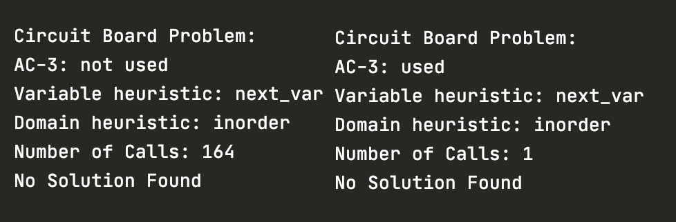
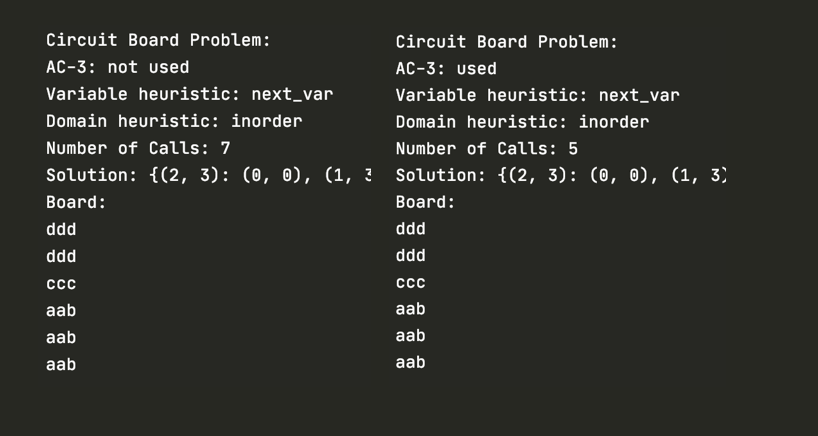
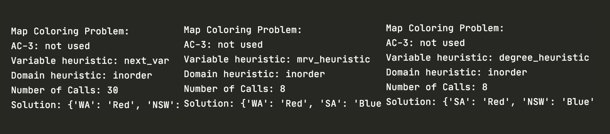
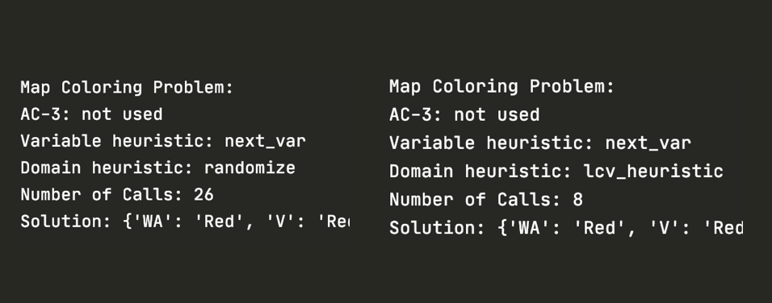

# CSP Solver Report
## Introduction:
This csp lab has 4 core files.
csp_problem.py has all the functions to solve a csp including backtracking, AC-3, etc.
heuristics.py has all the heuristics that csp_problem.py can use.
MapProblem.py is a csp for the map coloring problem.
CircuitProblem.py is a csp for the circuit board problem.

## Description:
### CSP Implementation
Backtracking: My backtracking implementation follows that of the pseudocode as it recuse though the possible assignments until it finds a match.
It also calls helper functions assign, select_var, var_domains and consistent.

Assign: The assign function assigns the variable to the value.
It then updates the domains of that and the variables it effects so we can keep track as we recuse.

select_var: returns a variable by calling a heuristic from heuristic.py (either next_possible, mrv, or degree)

var_domains: returns an ordered domains for that value a heuristic from heuristic.py (either inorder, random or lvc).

consistent: make sure that none of the constraints are violated (or in this case that ever case is allowed).

AC-3: Implemented the same as the pseudocode in the textbook with the helper function of revise.

### Map Coloring Implementation
The map coloring problem takes in 3 variables.
1. a list of the variables (in this case the states or countries)
2. a list of the  domain (colors it can be)
3. a list of tuples in which each tuple is two variables bordering each other (a constraint).
Note: put both directions for the list of tuples

The map coloring problem then uses csp to store number of calls and the solution.
It then prints out a solution nicely if print(csp) is called.

### Circuit Board Implementation
The circuit board problem takes in 2 variables.
1. a list of tuples. Each tuple contains a piece (x, y) where x is the width and y is the height of the piece.
2. a tuple of the board size (w, h) where w is the width and h is the height of the board

The circuit board problem also uses some helper functions to help set up the constraint and domain dictionaries.
It also has a function to print out the final board.
It uses csp to store number of calls and get the solution which can then be printed.

### Heuristics Implementation:
#### Variables Heuristics
next_var: Simply just returns the next variable unassigned.

mrv_heuristic: returns the variable with the smallest remaining domain by looping through all the variables and keeping track of which has the smallest domain.

degree_heuristic: loops through each variable and counts how many constraints that variable has on other non-assigned variables.
The variable with the smallest constraints is returned.

#### Domain Heuristics
inorder: Simply returns the domains for that variable. Will always have the same order.

randomize: Takes the domains for that variable and randomizes the list using random.shuffle().

lcv_heuristic: For the domain for that variable we create a dictionary to count the number of constraints each domain value would cause.
Then loop through the constraints, updating the dictionary for the amount of constraints for each domain value.
Then we create a list that orders the values in the dictionary and return that list.

## Evaluation:
The algorithm works very well on both types of problems.
The back-tracking algorithm solves for a solution and the AC-3 cuts down the amount of calls.
All my tests for the heuristics have yielded the most optimal amount of calls.
If you want to do your own testing, go into csp_problem and enable/disable AC-3 or change the heurstics.

#### AC-3 Testing:
From no solution for circuit board.
Without AC-3 it is 164 calls  but with AC-3, it cuts it down all the way to 1.

AC-3 cuts it down by a ton.

Here is another example from the fourth problem for circuit board where some backtracking is avoided and calls decrease from 7 to 5.

#### variable heuristic Testing:
From the third problem for map_coloring:

The heuristics cut down the number of calls from 30 to 8.

#### lcv_heuristic Testing:
From the fourth problem for map_coloring:

Randomize will return calls from around 8-30 yet lcv always has 8 calls.
